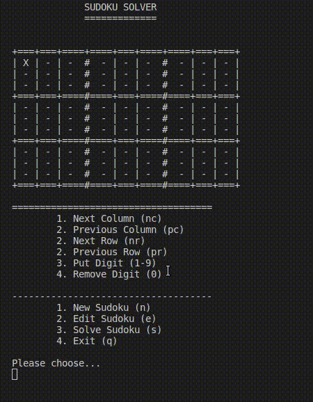

# Sudoku solver [WIP]

## Features (right now)

Right now everything is terminal based and in a very simple way displayed there

- Display a sudoku
- Create a new sudoku
- Move in grid
- Write digits
- Remove digits
- Quit program

### Roadmap

- Move with multiplicators i.e. 7nc would move 7 columns to the right
- Solve Sudoku
