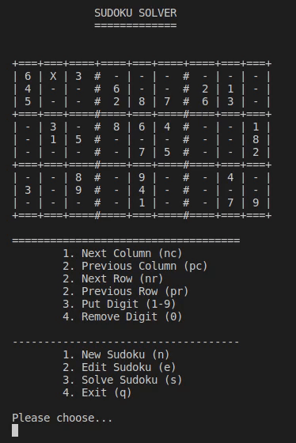

# Sudoku solver

## Features

Right now everything is terminal based and displayed in a very simple way

The features are:
- Display a Sudoku
- Create a new Sudoku
- Move in grid
  - Move with multiplicators e.g. 7nc means 7 columns to the right
- Write digits
- Remove digits
- Solve the next step in the Sudoku
- Quit program

### Roadmap

- Read Sudoku from file and display it
- Create QML GUI
- Use a build tool (Rake or Make)
- Solve Sudoku at once

## How to use

First you have to compile the program for your platform. Since this is such a small
program I didn't bother to use a build tool yet, but this is on the roadmap.
To compile it with e.g. gcc you have to use this command:

`gcc -o sudoku main.c src/terminal_view.c src/input_manager.c src/sudoku.c src/sudoku_analyzer.c`

Then you can execute the sudoku binary.
When you start the application it will display a sudoku which you are free to edit. You can navigate in the grid
with the commands that are displayed in the menu. So, `nc` would be next column and with a multiplier you can move
over many columns/rows at once.
The main purpose of this program is to solve a sudoku for you, so when you have finished editing your sudoku, you can
tell it to do so by calling the `s` command. This will solve your sudoku step by step, which means, you have to press the `s` multiple times.
